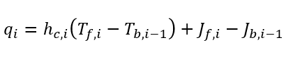
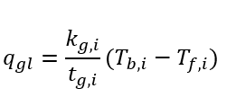
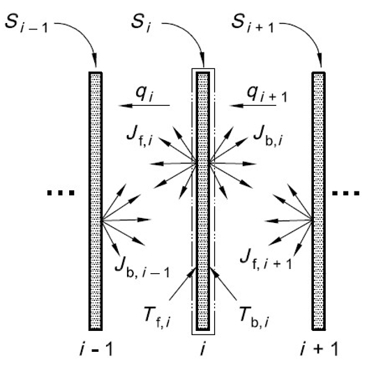
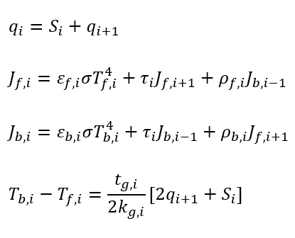

.. _theory:

***************
Theory
***************

To build the model with great detailed physical characteristics the methods that has been suggested by ISO 15099 has been used. ISO 15099 describes detailed thermal and optical calculation procedures for fenestration systems and is being used worldwide. It is utilized to evaluate the energy performance of any fenestration product size or configuration under a standard set of boundary conditions and contains a procedure for calculating the total thermal transmittance, total solar energy transmittance, and visible light transmittance.
The layers exchange heat with each other through convective and radiative heat transfer. This energy flows through the layer by conduction and creates a temperature gradient between back and front surfaces. Figure below shows energy balance for the i’th layer. The conductive and radiative heat transfer can be described based on the fundamental relations and for the convective heat transfer the experimental correlations can be applied. The heat flux across the i’th gap is:

Heat transfer through a solid layer is:

To find out the temperatures of the back and the front surfaces of each layer, these equations need to be applied at each layer. 

Herein, 
q_i is the heat flux across the i'th gap.
S_i is the absorbed solar irradiation by the i'th layer. 
J_(f,i) is radiosity of the front surface for i'th layer.
J_(b,i) is radiosity of the back surface for i'th layer.
ε,τ and ρ are the longwave Infra-red optical properties of each layer surface which are respectively emissivity, transmittance and reflectance.
t_(g,i) is the layer thickness and k_(g,i) is the layer conductivity. 
T_(f,i) and T_(b,i) are the front and back temperature of the i'th layer.
After forming all the equations and solving them for the unknown variables (surfaces’ temperature) the heat exchange between various part of the system can be easily calculated.
